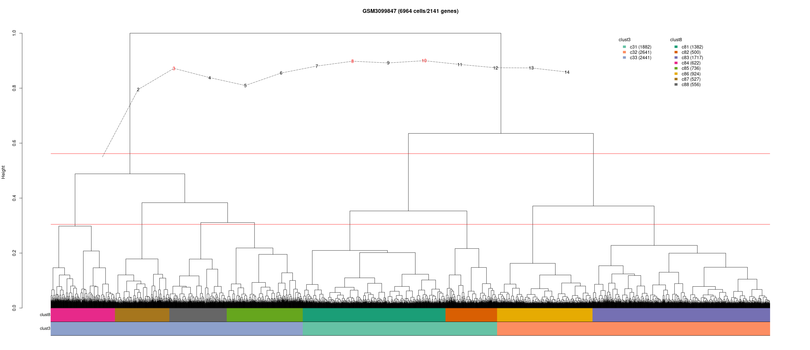
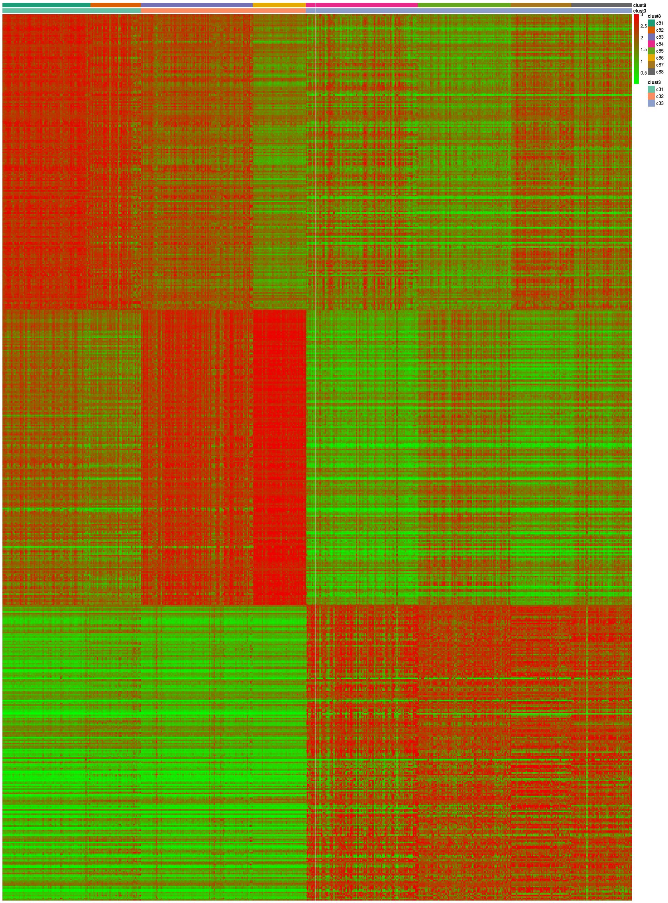
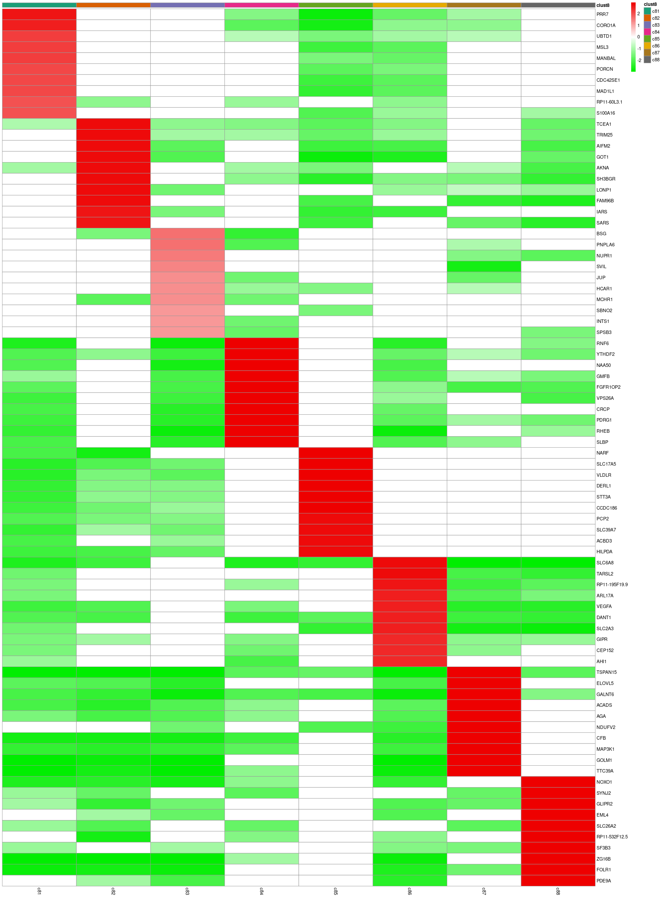
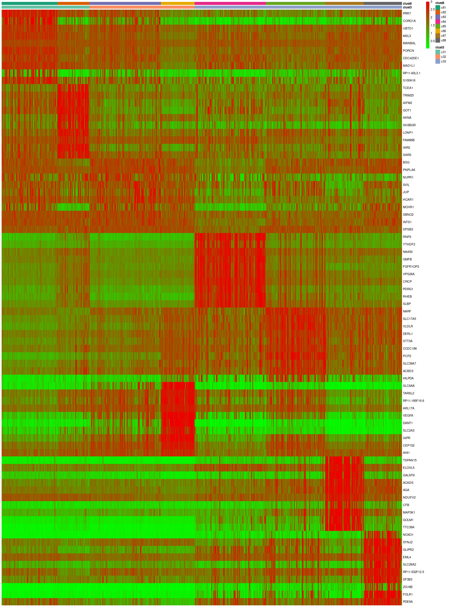

# Biblio

-   [Profiling human breast epithelial cells using single cell RNA
    sequencing identifies cell
    diversity](https://www.ncbi.nlm.nih.gov/pubmed/29795293)

-   [GSM3099847](https://www.ncbi.nlm.nih.gov/geo/query/acc.cgi?acc=GSM3099847)

# chunk n.1: downloading data

# chunk n.2: pre-processing data

# chunk n.3: preparing data for clustering

# Figure 1: Hierarchical clustering with Ward’s linkage and Euclidean distance of 6,964 single-cell profiles and 2,141 features. The first annotation bar is the partition of cells into eight groups; the second bar traces a partition of three clusters.

# chunk 4: preparing data for Figures 2 and 3

# Figure 2: Heat map of the top 200 standardized log fold-changes of each cluster in clust3 to a synthetic background.

-1.png)

# Figure 3: Heat map of the top 200 genes associated with each of the clusters in clust3.

# preparing data for Figures 4a and 4b

# Figure 4a: Heat map of standardized log fold-changes of each cluster in clust8 to a synthetic background.

# Figure 4b: Heat map of the genes associated with each of the clusters in clust8.

