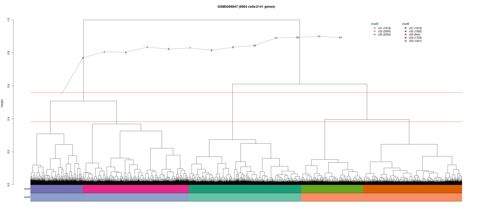
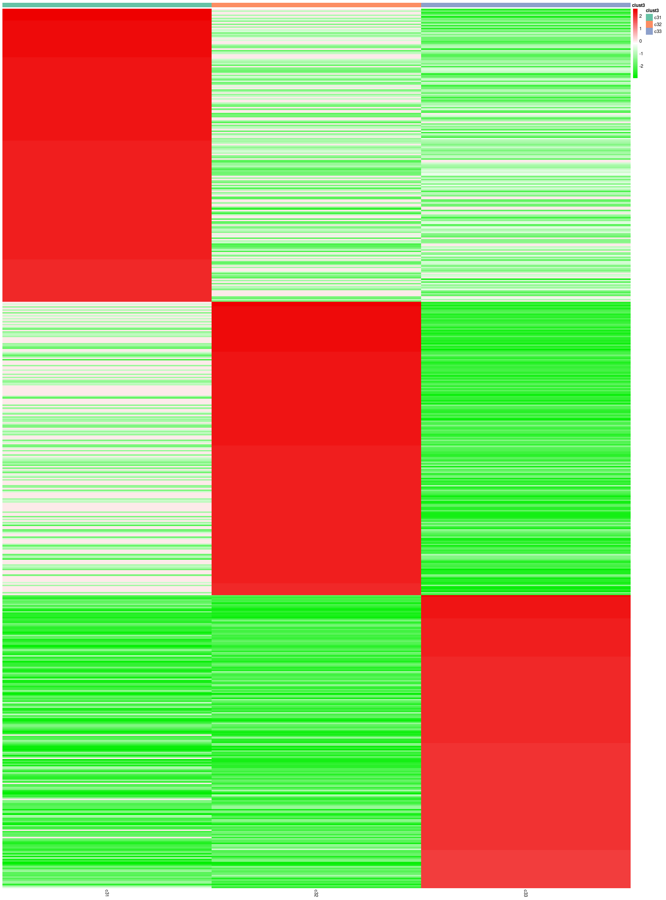
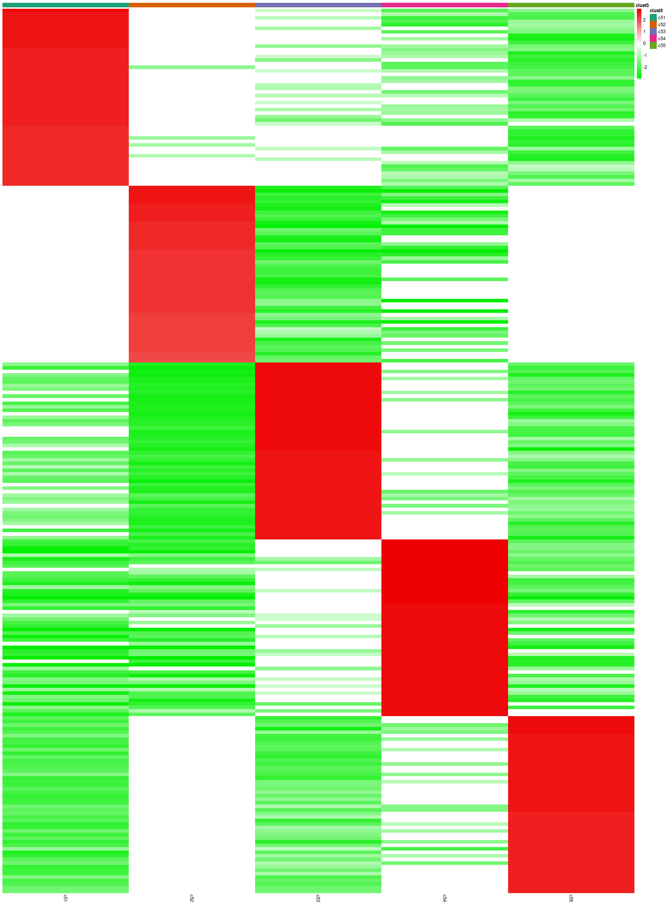
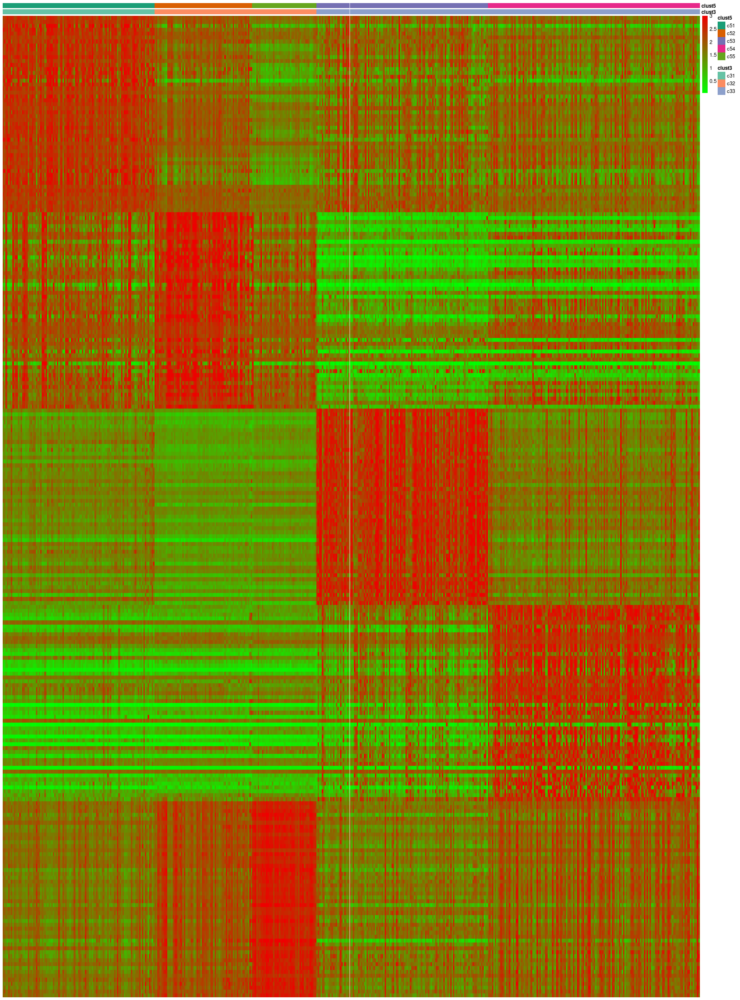
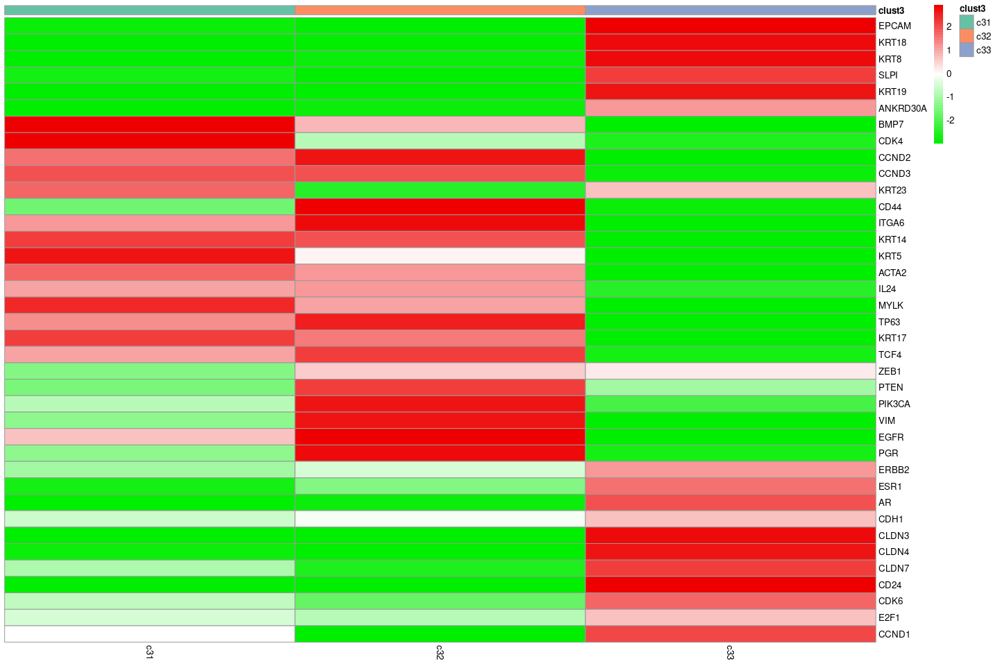
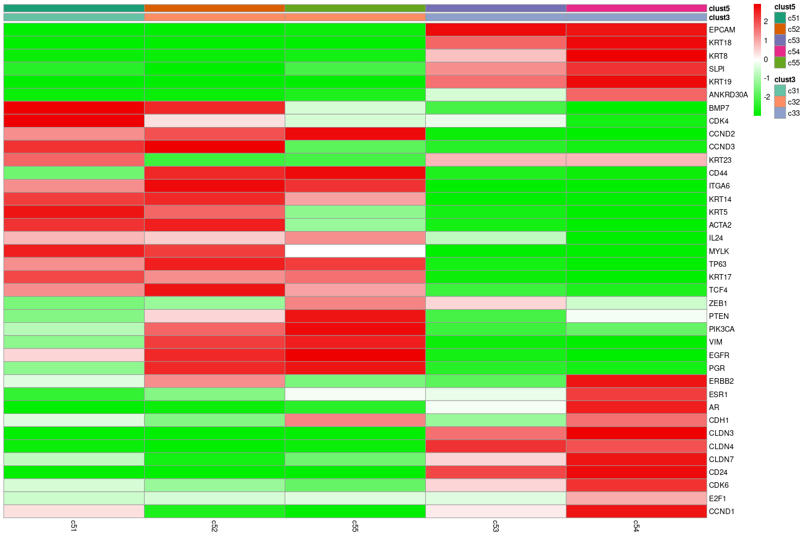

-   <a href="#chunk-n.1-downloading-data"
    id="toc-chunk-n.1-downloading-data">chunk n.1: downloading data</a>
-   <a href="#chunk-n.2-pre-processing-data"
    id="toc-chunk-n.2-pre-processing-data">chunk n.2: pre-processing
    data</a>
-   <a href="#chunk-n.3-preparing-data-for-clustering"
    id="toc-chunk-n.3-preparing-data-for-clustering">chunk n.3: preparing
    data for clustering</a>
-   <a
    href="#figure-1-hierarchical-clustering-with-wards-linkage-and-euclidean-distance-of-6964-single-cell-profiles-and-2141-features-selected-with-awst.-the-first-annotation-bar-is-the-partition-of-cells-into-five-groups-clust5-the-second-bar-traces-a-partition-of-three-clusters-clust3."
    id="toc-figure-1-hierarchical-clustering-with-wards-linkage-and-euclidean-distance-of-6964-single-cell-profiles-and-2141-features-selected-with-awst.-the-first-annotation-bar-is-the-partition-of-cells-into-five-groups-clust5-the-second-bar-traces-a-partition-of-three-clusters-clust3.">Figure
    1: Hierarchical clustering with Ward’s linkage and Euclidean distance of
    6,964 single-cell profiles and 2,141 features selected with AWST. The
    first annotation bar is the partition of cells into five groups
    (clust5); the second bar traces a partition of three clusters
    (clust3).</a>
-   <a href="#chunk-4-preparing-data-for-figures-2a-and-2b"
    id="toc-chunk-4-preparing-data-for-figures-2a-and-2b">chunk 4: preparing
    data for Figures 2a and 2b</a>
    -   <a href="#single_shot-function"
        id="toc-single_shot-function">single_shot function</a>
    -   <a href="#gsm3099847_saver_edaseq_ansdeseq2_clust3.rdata"
        id="toc-gsm3099847_saver_edaseq_ansdeseq2_clust3.rdata">GSM3099847_SAVER_EDASeq_ansDESeq2_clust3.RData</a>
-   <a
    href="#figure-2a-heat-map-of-each-clusters-top-200-standardized-log-fold-changes-in-clust3-to-a-synthetic-background.-green-means-under-regulation-to-the-background-level-red-means-up-regulation-to-the-background."
    id="toc-figure-2a-heat-map-of-each-clusters-top-200-standardized-log-fold-changes-in-clust3-to-a-synthetic-background.-green-means-under-regulation-to-the-background-level-red-means-up-regulation-to-the-background.">Figure
    2a: Heat-map of each cluster’s top 200 standardized log fold-changes in
    clust3 to a synthetic background. Green means under-regulation to the
    background level; red means up-regulation to the background.</a>
-   <a
    href="#figure-2b-heat-map-of-the-top-200-gene-expression-levels-associated-with-each-cluster-in-clust3.-green-means-no-expression-level-red-means-high-expression-level."
    id="toc-figure-2b-heat-map-of-the-top-200-gene-expression-levels-associated-with-each-cluster-in-clust3.-green-means-no-expression-level-red-means-high-expression-level.">Figure
    2b: Heat-map of the top 200 gene expression levels associated with each
    cluster in clust3. Green means no expression level; red means high
    expression level.</a>
-   <a href="#preparing-data-for-figures-3a-and-3b"
    id="toc-preparing-data-for-figures-3a-and-3b">preparing data for Figures
    3a and 3b</a>
    -   <a href="#gsm3099847_saver_edaseq_ansdeseq2_clust5.rdata"
        id="toc-gsm3099847_saver_edaseq_ansdeseq2_clust5.rdata">GSM3099847_SAVER_EDASeq_ansDESeq2_clust5.RData</a>
-   <a
    href="#figure-3a-heat-map-of-each-clusters-top-50-standardized-log-fold-changes-in-clust5-to-a-synthetic-background.-green-means-under-regulation-to-the-background-level-red-means-up-regulation-to-the-background."
    id="toc-figure-3a-heat-map-of-each-clusters-top-50-standardized-log-fold-changes-in-clust5-to-a-synthetic-background.-green-means-under-regulation-to-the-background-level-red-means-up-regulation-to-the-background.">Figure
    3a: Heat-map of each cluster’s top 50 standardized log fold-changes in
    clust5 to a synthetic background. Green means under-regulation to the
    background level; red means up-regulation to the background.</a>
-   <a
    href="#figure-3b-heat-map-of-the-top-50-gene-expression-levels-associated-with-each-cluster-in-clust5.-green-means-no-expression-level-red-means-high-expression-level."
    id="toc-figure-3b-heat-map-of-the-top-50-gene-expression-levels-associated-with-each-cluster-in-clust5.-green-means-no-expression-level-red-means-high-expression-level.">Figure
    3b: Heat-map of the top 50 gene expression levels associated with each
    cluster in clust5. Green means no expression level; red means high
    expression level.</a>
-   <a
    href="#supplementary-figure-1a-heat-map-of-each-clusters-standardized-log-fold-changes-in-clust3-to-a-synthetic-background.-green-means-under-regulation-to-the-background-level-red-means-up-regulation-to-the-background.-manually-selected-genes."
    id="toc-supplementary-figure-1a-heat-map-of-each-clusters-standardized-log-fold-changes-in-clust3-to-a-synthetic-background.-green-means-under-regulation-to-the-background-level-red-means-up-regulation-to-the-background.-manually-selected-genes.">Supplementary
    Figure 1a: Heat-map of each cluster’s standardized log fold-changes in
    clust3 to a synthetic background. Green means under-regulation to the
    background level; red means up-regulation to the background. Manually
    selected genes.</a>
-   <a
    href="#supplementary-figure-1b-heat-map-of-each-clusters-standardized-log-fold-changes-in-clust5-to-a-synthetic-background.-green-means-under-regulation-to-the-background-level-red-means-up-regulation-to-the-background.-manually-selected-genes."
    id="toc-supplementary-figure-1b-heat-map-of-each-clusters-standardized-log-fold-changes-in-clust5-to-a-synthetic-background.-green-means-under-regulation-to-the-background-level-red-means-up-regulation-to-the-background.-manually-selected-genes.">Supplementary
    Figure 1b: Heat-map of each cluster’s standardized log fold-changes in
    clust5 to a synthetic background. Green means under-regulation to the
    background level; red means up-regulation to the background. Manually
    selected genes.</a>
-   <a href="#biblio" id="toc-biblio">Biblio</a>

# chunk n.1: downloading data

    rm(list = ls())
    library(readr)
    Sys.setenv("VROOM_CONNECTION_SIZE"=131072*2) # ????
    ddata <- read_tsv("https://ftp.ncbi.nlm.nih.gov/geo/samples/GSM3099nnn/GSM3099847/suppl/GSM3099847_Ind5_Expression_Matrix.txt.gz", col_names = TRUE) 
    row_names <- ddata$`...1`
    ddata <- as.matrix(ddata[, -1])
    rownames(ddata) <- row_names
    tmp <- rowSums(ddata)
    ddata <- ddata[-which(tmp == 0),]
    object.size(ddata)
    mode(ddata) <- "integer"
    object.size(ddata)
    save(ddata, file = "GSM3099847.RData")

# chunk n.2: pre-processing data

    rm(list = ls())
    load("GSM3099847.RData")
    ################
    library(SAVER)
    ddata <- saver(as.data.frame(ddata), estimates.only = TRUE, ncores = 60)
    #save(ddata, file = "GSM3099847_SAVER.RData")
    ########################################
    library(EDASeq)
    ddata <- betweenLaneNormalization(ddata, which = "full", round = FALSE)
    save(ddata, file = "GSM3099847_SAVER_EDASeq.RData")

# chunk n.3: preparing data for clustering

    rm(list = ls())
    load("GSM3099847_SAVER_EDASeq.RData")
    library(awst)
    exprData <- awst(ddata, poscount = TRUE, full_quantile = TRUE)
    dim(exprData <- gene_filter(exprData)) #[1]  2141 6964 GSM3099847_EDASeq.RData
    exprData <- t(exprData)
    nrow_exprData <- nrow(exprData)
    ncol_exprData <- ncol(exprData)
    ddist <- dist(exprData)
    hhc <- hclust(ddist, method = "ward.D2")

    source("https://raw.githubusercontent.com/stefanoMP/functions/main/calinski_20210214.R")
    aCalinski <- calinski(hhc)
    save(hhc, nrow_exprData, ncol_exprData, aCalinski, file = "GSM3099847_SAVER_EDASeq_AWST_hclust.RData")

# Figure 1: Hierarchical clustering with Ward’s linkage and Euclidean distance of 6,964 single-cell profiles and 2,141 features selected with AWST. The first annotation bar is the partition of cells into five groups (clust5); the second bar traces a partition of three clusters (clust3).

    rm(list = ls())
    suppressPackageStartupMessages(library(dendextend))
    library(RColorBrewer)
    source("https://raw.githubusercontent.com/stefanoMP/functions/main/calinski_20210214.R")

    load("GSM3099847_SAVER_EDASeq_AWST_hclust.RData")

    clustering.prefix <- "clust"; short.prefix <- "c"
    clustering.df <- data.frame(row.names = hhc$labels, barcode = hhc$labels)
    clust.colorCode <- NULL
    ############
    mmain  <-  paste0("GSM3099847 (", nrow_exprData, " cells/", ncol_exprData, " genes)")
    hhc$height <- hhc$height/max(hhc$height)

    #png("Figure1.png", width= 1500, height= 750, res = 1/300)
    plot(hhc, hang = -1, labels = FALSE, xlab = "", sub = "", main = mmain)
    plot(aCalinski, add = TRUE, from = 500, to = 5000, shift = 0.55, height = 0.35, max_height = 1)
    ###
    clustering.df$reduced <- as.factor(cutree(hhc, k = 500))
    ###
    no_of_clusters <- 3
    clustering_name <- paste0(clustering.prefix, no_of_clusters)
    clustering_name.col <- paste0(clustering_name, ".col")

    hh <- (hhc$height[length(hhc$height)-no_of_clusters+2] + hhc$height[length(hhc$height)-no_of_clusters+1])/2
    segments(1, hh, nrow_exprData, hh, col = "red") # cut the tree

    tmp <- as.factor(cutree(hhc, k = no_of_clusters)) # get the clusters
    levels(tmp) <- paste0(short.prefix, no_of_clusters, c(paste(1:9), letters))[1:no_of_clusters]
    assign(clustering_name, tmp)

    levels(tmp) <- brewer.pal(n = no_of_clusters, name = "Set2")
    assign(clustering_name.col, tmp)

    clustering.df$tmp <- get(clustering_name)
    clustering.df$tmp.col <- get(clustering_name.col)

    tt <- table(clustering.df$tmp, clustering.df$tmp.col)
    colorCode <- colnames(tt)[apply(tt, 1, which.max)]
    names(colorCode) <- rownames(tt)
    clust.colorCode <- c(clust.colorCode, colorCode)

    tmp <- grep("tmp", colnames(clustering.df))
    colnames(clustering.df)[tmp] <- gsub("tmp", clustering_name, colnames(clustering.df)[tmp])
    ###
    no_of_clusters <- 5
    clustering_name <- paste0(clustering.prefix, no_of_clusters)
    clustering_name.col <- paste0(clustering_name, ".col")

    hh <- (hhc$height[length(hhc$height)-no_of_clusters+2] + hhc$height[length(hhc$height)-no_of_clusters+1])/2
    segments(1, hh, nrow_exprData, hh, col = "red") # cut the tree

    tmp <- as.factor(cutree(hhc, k = no_of_clusters)) # get the clusters
    levels(tmp) <- paste0(short.prefix, no_of_clusters, c(paste(1:9), letters))[1:no_of_clusters]
    assign(clustering_name, tmp)

    levels(tmp) <- brewer.pal(n = no_of_clusters, name = "Dark2")
    assign(clustering_name.col, tmp)

    clustering.df$tmp <- get(clustering_name)
    clustering.df$tmp.col <- get(clustering_name.col)

    tt <- table(clustering.df$tmp, clustering.df$tmp.col)
    colorCode <- colnames(tt)[apply(tt, 1, which.max)]
    names(colorCode) <- rownames(tt)
    clust.colorCode <- c(clust.colorCode, colorCode)

    tmp <- grep("tmp", colnames(clustering.df))
    colnames(clustering.df)[tmp] <- gsub("tmp", clustering_name, colnames(clustering.df)[tmp])
    ############
    save(clustering.df, clust.colorCode, 
         file = "GSM3099847_SAVER_EDASeq_AWST_hclust_clustering.RData")
    ###
    clustering.col <- clustering.df[, grep(".col", colnames(clustering.df))]
    colnames(clustering.col) <- gsub(".col", "", colnames(clustering.col))
    colored_bars(colors = clustering.col, dend = as.dendrogram(hhc), y_scale = 0.1, y_shift = 0.)
    #######################
    tt <- table(clustering.df$clust3)
    llegend <- paste(names(tt), " (", tt, ")", sep = "")
    ffill <- clust.colorCode[names(tt)]
    legend(5500, 0.99, legend=llegend, fill = ffill, y.intersp = 1, box.col = "white", border = "white", title = "clust3", title.adj = 0)

    tt <- table(clustering.df$clust5)
    llegend <- paste(names(tt), " (", tt, ")", sep = "")
    ffill <- clust.colorCode[names(tt)]
    legend(6000, 0.99, legend=llegend, fill = ffill, y.intersp = 1, box.col = "white", border = "white", title = "clust5", title.adj = 0)

# chunk 4: preparing data for Figures 2a and 2b

## single\_shot function

    single_shot <- function() {
      annotation.tmp <- clustering.df
      (mmin <- min(tt <- table(annotation.tmp$design)))
      nooc <- length(tt) # no of clusters
      tmp <- c() 
      for(this_cluster in unique(annotation.tmp$design)) tmp <- c(tmp, 
          sample(annotation.tmp$barcode[annotation.tmp$design == this_cluster], mmin/nooc, replace = FALSE))
      annotation.tmp$design[annotation.tmp$barcode %in% tmp] <- "000" # synthetic background
    #  addmargins(table(annotation.tmp$design, annotation.tmp$clust3))
      
      (m <- min(table(annotation.tmp$design))/3)
      tmp <- c() 
      for(this_cluster in unique(annotation.tmp$design))
      tmp <- c(tmp, sample(annotation.tmp$barcode[annotation.tmp$design == this_cluster], m, replace = TRUE))
      annotation.tmp <- annotation.tmp[tmp,]
    #  addmargins(table(annotation.tmp$design, annotation.tmp$clust3))
      
      for(i in 1:nrow(annotation.tmp)) annotation.tmp$id[i] <- paste(sample(c(letters, LETTERS, 0:9), 15, replace = TRUE), collapse = "")
      sum(duplicated(annotation.tmp$id))
      
      data.tmp <- ddata[, annotation.tmp$barcode]
      colnames(data.tmp) <- annotation.tmp$id
      rownames(annotation.tmp) <- annotation.tmp$id
      annotation.tmp$design <- factor(annotation.tmp$design)
      dds <- DESeqDataSetFromMatrix(countData = data.tmp, colData = annotation.tmp, design = ~ design)
      
      tmp <- scran::computeSumFactors(dds)
      dds@colData@listData[["sizeFactor"]] <- tmp@colData@listData$sizeFactor

      ans_DESeq <- DESeq(dds, test = "Wald", useT = T, minmu = 1e-6, fitType='local' , minReplicatesForReplace = Inf)
      #   user  system elapsed 
      #363.078 181.417 322.000 
      ans_DESeq <- mcols(ans_DESeq, use.names=TRUE)
      ans_DESeq <- data.frame(ans_DESeq)
      invisible(ans_DESeq)
    }

## GSM3099847\_SAVER\_EDASeq\_ansDESeq2\_clust3.RData

    rm(list = ls())
    load("GSM3099847_SAVER_EDASeq.RData")
    ddata <- apply(ddata, 2, function(x) x/sum(x)*1e6) # makes similar to raw-counts
    mode(ddata) <- "integer"

    load("GSM3099847_SAVER_EDASeq_AWST_hclust_clustering.RData")
    clustering.df$design <- as.character(clustering.df$clust3)
    clustering.df$id <- NA

    library(DESeq2)
    library(scran)

    system.time(ans <- single_shot())
    #   user  system elapsed 
    #348.383 116.882 327.354 
    WaldStatistic_design <- grep("WaldStatistic_design", colnames(ans))
    tmp <- ans[, WaldStatistic_design]

    runs <- 50
    k <- 2
    while(k <= runs) {
      system.time(ans <- single_shot())
      tmp <- tmp + ans[, WaldStatistic_design]
      k <- k + 1
    }
    ans <- tmp/runs
    ans <- ans[-which(is.na(ans[, 1])),]
    colnames(ans) <- unique(clustering.df$design)
    save(ans, file = "GSM3099847_SAVER_EDASeq_ansDESeq2_clust3.RData")

# Figure 2a: Heat-map of each cluster’s top 200 standardized log fold-changes in clust3 to a synthetic background. Green means under-regulation to the background level; red means up-regulation to the background.

    rm(list = ls())
    load("GSM3099847_SAVER_EDASeq_AWST_hclust_clustering.RData")
    load("GSM3099847_SAVER_EDASeq_ansDESeq2_clust3.RData")
    #head(ans)

    alpha <- 0.01
    suppressPackageStartupMessages(require(pheatmap))

    p.values <- 2*(1-pnorm(abs(as.matrix(ans))))
    p.values <- apply(p.values, 2, p.adjust, method = "BH")

    ans <- ans * (p.values < alpha)
    ans <- ans[rowSums(ans > 0) == 1,]

    max_tops <- 200
    ttable <- table(colnames(ans)[apply(ans, 1, which.max)])
    K <- sapply(ttable, function(x) min(max_tops, x))

    j <- 1
    tops <- head(rownames(ans[order(ans[, j], decreasing = TRUE),]), K[j])
    for(j in 2:ncol(ans))
      tops <- c(tops, head(rownames(ans[order(ans[, j], decreasing = TRUE),]), K[j]))

    ans <- apply(ans[tops,], 2, function(x) x/sqrt(mean(x^2)))
    ans <- 6 * (pnorm(ans) - 0.5)
    #ans <- ans * (ans > 2)

    annotation_col <- data.frame(clust3 = colnames(ans), row.names = colnames(ans))
    ann_colors = list(clust3 = clust.colorCode[grep("c3", names(clust.colorCode))])

    #png("Figure2a.png", width= 750, height= 750, res = 1/300)
    pheatmap(ans, cluster_rows=FALSE, cluster_cols=FALSE,show_rownames = FALSE, 
             annotation_col=annotation_col, annotation_colors = ann_colors,
             color = colorRampPalette(c("green2", "white", "red2"))(51))

# Figure 2b: Heat-map of the top 200 gene expression levels associated with each cluster in clust3. Green means no expression level; red means high expression level.

    load("GSM3099847_SAVER_EDASeq.RData")
    ###
    rdata <- as.data.frame(t(ddata[tops,]))
    rdata <- aggregate(rdata, list(reduced = clustering.df$reduced), mean)[, -1]
    rdata <- apply(rdata, 2, function(x) x/sqrt(mean(x^2)))
    rdata <- t(rdata)

    colnames(rdata) <- paste0("R", 1:ncol(rdata))
    rdata <- 6*(pnorm(rdata) - 0.5)

    tt <- table(clustering.df$reduced, clustering.df$clust3)
    tt <- colnames(tt)[apply(tt, 1, which.max)]
    annotation_col <- data.frame(row.names = colnames(rdata), clust3 = tt)
    tt <- table(clustering.df$reduced, clustering.df$clust5)
    tt <- colnames(tt)[apply(tt, 1, which.max)]
    annotation_col$clust5 <- tt
    annotation_col <- annotation_col[order(annotation_col$clust3, annotation_col$clust5),]
    rdata <- rdata[, rownames(annotation_col)]

    ann_colors <- list(clust3 = clust.colorCode[grep("c3", names(clust.colorCode))],
                       clust5 = clust.colorCode[grep("c5", names(clust.colorCode))])

    #png("Figure2b.png", width= 750, height= 750, res = 1/300)
    pheatmap(rdata, cluster_rows=FALSE, cluster_cols=FALSE, show_colnames = FALSE, show_rownames = FALSE, 
             annotation_col = annotation_col, annotation_colors = ann_colors,
             color = colorRampPalette(c("green", "red2"))(50))

# preparing data for Figures 3a and 3b

## GSM3099847\_SAVER\_EDASeq\_ansDESeq2\_clust5.RData

    rm(list = ls())
    load("GSM3099847_SAVER_EDASeq.RData")
    ddata <- apply(ddata, 2, function(x) x/sum(x)*1e6) # makes similar to raw-counts
    mode(ddata) <- "integer"

    load("GSM3099847_SAVER_EDASeq_AWST_hclust_clustering.RData")
    clustering.df$design <- as.character(clustering.df$clust5)
    clustering.df$id <- NA

    library(DESeq2)
    library(scran)

    system.time(ans <- single_shot())
    WaldStatistic_design <- grep("WaldStatistic_design", colnames(ans))
    tmp <- ans[, WaldStatistic_design]

    runs <- 50
    k <- 2
    while(k <= runs) {
      message(k, "   -   ", Sys.time())
      ans <- single_shot()
      tmp <- tmp + ans[, WaldStatistic_design]
      k <- k + 1
    }
    ans <- tmp/runs
    ans <- ans[-which(is.na(ans[, 1])),]
    colnames(ans) <- unique(clustering.df$design)
    save(ans, file = "GSM3099847_SAVER_EDASeq_ansDESeq2_clust5.RData")

# Figure 3a: Heat-map of each cluster’s top 50 standardized log fold-changes in clust5 to a synthetic background. Green means under-regulation to the background level; red means up-regulation to the background.

    rm(list = ls())
    load("GSM3099847_SAVER_EDASeq_AWST_hclust_clustering.RData")
    load("GSM3099847_SAVER_EDASeq_ansDESeq2_clust5.RData")
    #head(ans)

    alpha <- 0.01

    p.values <- 2*(1-pnorm(abs(as.matrix(ans))))
    p.values <- apply(p.values, 2, p.adjust, method = "BH")

    ans <- ans * (p.values < alpha)
    ans <- ans[rowSums(ans > 0) == 1,]

    max_tops <- 50
    ttable <- table(colnames(ans)[apply(ans, 1, which.max)])
    K <- sapply(ttable, function(x) min(max_tops, x))

    j <- 1
    tops <- head(rownames(ans[order(ans[, j], decreasing = TRUE),]), K[j])
    for(j in 2:ncol(ans))
      tops <- c(tops, head(rownames(ans[order(ans[, j], decreasing = TRUE),]), K[j]))

    ans <- apply(ans[tops,], 2, function(x) x/sqrt(mean(x^2)))
    ans <- 6 * (pnorm(ans) - 0.5)

    annotation_col <- data.frame(clust5 = colnames(ans), row.names = colnames(ans))
    ann_colors = list(clust5 = clust.colorCode[grep("c5", names(clust.colorCode))])

    suppressPackageStartupMessages(require(pheatmap))
    #png("Figure3a.png", width= 750, height= 750, res = 1/300)
    pheatmap(ans, cluster_rows=FALSE, cluster_cols=FALSE,show_rownames = FALSE, 
             annotation_col=annotation_col, annotation_colors = ann_colors,
             color = colorRampPalette(c("green2", "white", "red2"))(51))

# Figure 3b: Heat-map of the top 50 gene expression levels associated with each cluster in clust5. Green means no expression level; red means high expression level.

    load("GSM3099847_SAVER_EDASeq.RData")
    ###
    rdata <- ddata[tops,]
    rdata <- aggregate(as.data.frame(t(rdata)), list(reduced = clustering.df$reduced), mean)[, -1]
    rdata <- apply(rdata, 2, function(x) x/sqrt(mean(x^2)))
    rdata <- t(rdata)

    colnames(rdata) <- paste0("R", 1:ncol(rdata))
    rdata <- 6*(pnorm(rdata) - 0.5)

    tt <- table(clustering.df$reduced, clustering.df$clust3)
    tt <- colnames(tt)[apply(tt, 1, which.max)]
    annotation_col <- data.frame(row.names = colnames(rdata), clust3 = tt)

    tt <- table(clustering.df$reduced, clustering.df$clust5)
    tt <- colnames(tt)[apply(tt, 1, which.max)]
    annotation_col$clust5 <- tt
    annotation_col <- annotation_col[order(annotation_col$clust3, annotation_col$clust5),]

    ann_colors = list(clust3 = clust.colorCode[grep("c3", names(clust.colorCode))], 
                      clust5 = clust.colorCode[grep("c5", names(clust.colorCode))])
    rdata <- rdata[, rownames(annotation_col)]

    #png("Figure3b.png", width= 750, height= 750, res = 1/300)
    pheatmap(rdata, cluster_rows=FALSE, cluster_cols=FALSE, 
             show_colnames = FALSE, show_rownames = FALSE, 
             annotation_col = annotation_col, annotation_colors = ann_colors,
             color = colorRampPalette(c("green", "red2"))(51))

# Supplementary Figure 1a: Heat-map of each cluster’s standardized log fold-changes in clust3 to a synthetic background. Green means under-regulation to the background level; red means up-regulation to the background. Manually selected genes.

    rm(list = ls())
    load("GSM3099847_SAVER_EDASeq_AWST_hclust_clustering.RData")
    load("GSM3099847_SAVER_EDASeq_ansDESeq2_clust3.RData")
    ans <- apply(ans, 2, function(x) x/sqrt(mean(x^2)))
    ans <- 6 * (pnorm(ans) - 0.5)
    ##################
    these_genes <- unique(c("EPCAM", "KRT18",  "KRT8", "SLPI", "KRT19","ANKRD30A", "BMP7", "CDK4", "CCND2", "CCND3", "KRT23", "CD44", "ITGA6", "KRT14", "KRT5", "ACTA2", "IL24", "MYLK",  "TP63", "KRT17", "TCF4", "ZEB1",  "PTEN", "PIK3CA", "VIM",  "EGFR", "PGR", "ERBB2", "ESR1", "AR", "CDH1", "CLDN3","CLDN4", "CLDN7", "CD24","CDK6", "E2F1", "CCND1"))
    #setdiff(these_genes, rownames(ans))
    these_genes <- intersect(these_genes, rownames(ans))
    ###

    annotation_col <- data.frame(clust3 = colnames(ans), row.names = colnames(ans))
    ann_colors = list(clust3 = clust.colorCode[grep("c3", names(clust.colorCode))])

    ans <- ans[these_genes,]

    require(pheatmap)
    pheatmap(ans, cluster_rows=FALSE, cluster_cols=FALSE,show_rownames = TRUE, 
             annotation_col=annotation_col, annotation_colors = ann_colors,
             color = colorRampPalette(c("green2", "white", "red2"))(51))

# Supplementary Figure 1b: Heat-map of each cluster’s standardized log fold-changes in clust5 to a synthetic background. Green means under-regulation to the background level; red means up-regulation to the background. Manually selected genes.

    load("GSM3099847_SAVER_EDASeq_ansDESeq2_clust5.RData")
    ans <- apply(ans, 2, function(x) x/sqrt(mean(x^2)))
    ans <- 6 * (pnorm(ans) - 0.5)
    ###

    tt <- table(clustering.df$clust5, clustering.df$clust3)
    tt <- colnames(tt)[apply(tt, 1, which.max)]
    annotation_col <- data.frame(row.names = colnames(ans), clust3 = tt)

    annotation_col$clust5 <- colnames(ans)
    annotation_col <- annotation_col[order(annotation_col$clust3, annotation_col$clust5),]

    ann_colors = list(clust3 = clust.colorCode[grep("c3", names(clust.colorCode))], 
                      clust5 = clust.colorCode[grep("c5", names(clust.colorCode))])

    ans <- ans[these_genes, annotation_col$clust5]

    pheatmap(ans, cluster_rows=FALSE, cluster_cols=FALSE,show_rownames = TRUE, 
             annotation_col=annotation_col, annotation_colors = ann_colors,
             color = colorRampPalette(c("green2", "white", "red2"))(51))

# Biblio

-   [Profiling human breast epithelial cells using single cell RNA
    sequencing identifies cell
    diversity](https://www.ncbi.nlm.nih.gov/pubmed/29795293)

-   [GSM3099847](https://www.ncbi.nlm.nih.gov/geo/query/acc.cgi?acc=GSM3099847)
